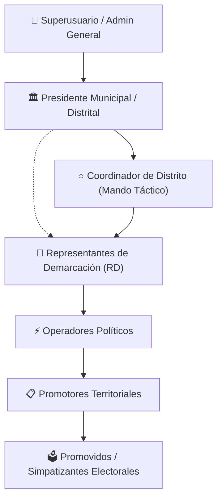

# 🏛️ ORION SISTEMAS · CONTROL POLÍTICO Y ESTRUCTURA TERRITORIAL
## Módulo Ejecutivo: Coordinadores de Distrito

> **Guía Ejecutiva y Comercial para Directores de Campaña, Candidatos y Equipos Políticos**  
> *Versión 2.0 · Plataforma Integral de Gestión Territorial y Movilización Ciudadana*

---

## 📌 1. Resumen Ejecutivo (Executive Summary)

En campañas políticas modernas y estructuras partidistas de alta exigencia, la **toma de decisiones ágil** y el **control territorial en tiempo real** son determinantes para asegurar el éxito electoral.

El rol y módulo de **Coordinador de Distrito** en **ORION Sistemas** nace como respuesta a una necesidad crítica: **delegar la supervisión operativa del territorio sin perder la visión estratégica ni la integridad de los datos.**

```
                           ┌───────────────────────────────┐
                           │      PRESIDENTE / LÍDER       │
                           │   (Estrategia y Mando Raíz)   │
                           └───────────────┬───────────────┘
                                           │
                                           ▼
                           ┌───────────────────────────────┐
                           │    COORDINADOR DE DISTRITO    │  ◄── [NUEVO MÓDULO]
                           │  (Supervisión Táctica Total)  │
                           └───────────────┬───────────────┘
                                           │
            ┌──────────────────────────────┼──────────────────────────────┐
            ▼                              ▼                              ▼
┌───────────────────────┐      ┌───────────────────────┐      ┌───────────────────────┐
│  REPRESENTANTE (RD)   │      │  REPRESENTANTE (RD)   │      │  REPRESENTANTE (RD)   │
│     Demarcación 1     │      │     Demarcación 2     │      │     Demarcación 3     │
└───────────┬───────────┘      └───────────┬───────────┘      └───────────┬───────────┘
            ▼                              ▼                              ▼
┌───────────────────────┐      ┌───────────────────────┐      ┌───────────────────────┐
│  OPERADORES POLÍTICOS │      │  OPERADORES POLÍTICOS │      │  OPERADORES POLÍTICOS │
└───────────┬───────────┘      └───────────┬───────────┘      └───────────┬───────────┘
            ▼                              ▼                              ▼
┌───────────────────────┐      ┌───────────────────────┐      ┌───────────────────────┐
│  PROMOTORES DE CAMPO  │      │  PROMOTORES DE CAMPO  │      │  PROMOTORES DE CAMPO  │
└───────────┬───────────┘      └───────────┬───────────┘      └───────────┬───────────┘
            ▼                              ▼                              ▼
┌───────────────────────┐      ┌───────────────────────┐      ┌───────────────────────┐
│ SIMPATIZANTES (PROMO) │      │ SIMPATIZANTES (PROMO) │      │ SIMPATIZANTES (PROMO) │
└───────────────────────┘      └───────────────────────┘      └───────────────────────┘
```

### ¿Qué valor aporta a su equipo?
1. **Espejo Operativo del Presidente**: El Coordinador de Distrito cuenta con la visibilidad completa de la estructura territorial de su Presidente asignado (Representantes Demarcacionales, Operadores, Promotores y Simpatizantes Promovidos).
2. **Descentralización del Liderazgo**: Permite a directores operativos de distrito o coordinadores territoriales auditar metas, validar trabajo en campo y resolver cuellos de botella sin requerir que el candidato o presidente comparta su cuenta personal.
3. **Seguridad y Aislamiento de Datos**: El Coordinador solo tiene acceso a la estructura, municipios y demarcaciones que le corresponden por jerarquía política, blindando la información de otros municipios o distritos.

---

## 🎯 2. Pirámide Jerárquica y Flujo de Mando

ORION Sistemas implementa una arquitectura en árbol estricta donde cada nivel nutre y responde al nivel superior:



| Nivel | Rol en ORION | Función Clave en Campo |
| :--- | :--- | :--- |
| **Nivel 1** | `Superuser` / `Admin` | Administración del sistema, control global de entidades, configuración de estados y presidentes. |
| **Nivel 2** | `Presidente` | Candidato o Presidente de Comité. Dueño de la estructura territorial y metas generales del municipio/distrito. |
| **Nivel 2.5** | **`Coordinador de Distrito`** | **Brazo ejecutor del Presidente. Monitorea avances, metas por sección y coordina a todos los RDs y operadores.** |
| **Nivel 3** | `Representante (RD)` | Responsable asignado a una demarcación geográfica específica. Coordina sus operadores y promotores. |
| **Nivel 4** | `Operador Político` | Enlace territorial directo con líderes vecinales y movilizadores. |
| **Nivel 5** | `Promotor` | Brigadista que registra a los ciudadanos simpatizantes en campo. |
| **Nivel 6** | `Promovido` | Ciudadano simpatizante con intención de voto confirmada y georreferenciada. |

---

## 💼 3. Capacidades y Matriz de Permisos del Coordinador

El Coordinador de Distrito tiene acceso a las herramientas tácticas de supervisión y gestión operativa:

| Módulo / Función | ¿Qué puede hacer el Coordinador de Distrito? | Beneficio Operativo |
| :--- | :---: | :--- |
| **Dashboard en Tiempo Real** | ✅ **Acceso Total** | Visualiza contadores de RDs, Operadores, Promotores, Promovidos y la gráfica de tendencia de crecimiento semanal de su distrito. |
| **Representantes (RD)** | ✅ **Gestión y Consulta** | Puede dar de alta nuevos RDs, editar sus datos de contacto, asignar demarcaciones y verificar cuántos operadores tiene cada uno. |
| **Operadores Políticos** | ✅ **Gestión y Consulta** | Supervisa la red de operadores, su líder responsable y el volumen de promotores que coordinan. |
| **Promotores de Campo** | ✅ **Gestión y Consulta** | Verifica la plantilla de promotores activos, apoyos entregados y productividad individual. |
| **Simpatizantes (Promovidos)** | ✅ **Supervisión y Registro** | Acceso a la base de votantes simpatizantes con filtros por CURP, teléfono, sección electoral y colonia. |
| **Mapa Territorial Interactivo** | ✅ **Visualización Cartográfica** | Semáforo de cumplimiento de metas por polígono/demarcación (Rojo: Rezagado, Amarillo: En Proceso, Verde: Meta Cumplida). |
| **Demarcaciones y Secciones** | ✅ **Consulta de Catálogo** | Consulta metas asignadas, lista de secciones electorales y límites territoriales. |
| **Bitácora de Actividades** | ✅ **Auditoría Local** | Revisa quién registró o modificó qué información dentro de su propio distrito para evitar duplicidades. |
| **Exportación a Excel / CSV** | ✅ **Descarga Segura** | Descarga padrones filtrados para operativos de campo o validación de INE. |
| **Gestión Global de Presidentes** | ❌ **Restringido** | Reservado exclusivamente para Superusuarios y Administradores Centrales. |

---

## 🛠️ 4. Flujo Operativo Paso a Paso (Guía de Uso)

### Paso 1: Alta y Asignación del Coordinador
1. Un **Superusuario** o **Presidente** ingresa al menú lateral **`Coordinadores de Distrito`**.
2. Da clic en **`+ Nuevo Coordinador`** (o utiliza el botón rápido `⚡ Llenar datos de prueba` en entornos de demostración).
3. Completa los datos personales (Nombre, Apellidos, Teléfono, CURP, INE y Fotografía).
4. El sistema lo vincula de manera automática con la estructura del Presidente correspondiente y le crea sus credenciales de acceso seguras.

---

### Paso 2: Centro de Mando (Dashboard Táctico)
Al iniciar sesión, el Coordinador visualiza:
- **Tarjetas de Estado**: Total de RDs activos, Operadores, Promotores y Promovidos.
- **Gráfica de Crecimiento**: Línea temporal comparativa de las últimas 5 semanas para evaluar la velocidad de captación en campo.
- **Distribución por Colonias**: Top de colonias con mayor penetración de simpatizantes.
- **Resumen por Demarcación**: Tabla comparativa con el porcentaje de avance respecto a la meta electoral.

---

### Paso 3: Monitoreo Territorial en el Mapa
1. El Coordinador ingresa a **`Mapa Territorial`**.
2. Visualiza los polígonos de cada demarcación coloreados dinámicamente según el porcentaje de meta alcanzada:
   - 🔴 **0% a 49%**: Demarcación con foco rojo (requiere refuerzo de brigadas).
   - 🟡 **50% a 89%**: Demarcación en avance normal.
   - 🟢 **90% a 100%+**: Demarcación con meta electoral consolidada.
3. Al hacer clic en cualquier polígono, el sistema despliega el detalle de promotores y simpatizantes registrados en esa zona.

---

### Paso 4: Supervisión de Promotores y Promovidos
1. Ingresa a **`Promovidos`** u **`Operadores`**.
2. Aplica filtros combinados:
   - Búsqueda por Nombre, CURP o Clave de Elector (INE).
   - Filtro por Demarcación o Sección Electoral específica.
   - Rango de fechas de registro.
3. Genera exportaciones en tiempo real para armar listados de movilización para el día de la jornada electoral (Día D).

---

## 💎 5. Ventajas Competitivas para Campañas Políticas

```
┌─────────────────────────────────────────────────────────────────────────────┐
│                    VALOR AGREGADO DE ORION SISTEMAS                         │
├────────────────────────────────┬────────────────────────────────────────────┤
│ 🚀 Delegación Efectiva         │ Permite al Candidato concentrarse en gira  │
│                                │ mientras el Coordinador audita la meta.    │
├────────────────────────────────┼────────────────────────────────────────────┤
│ 📍 Cero Puntos Ciegos          │ El semáforo cartográfico detecta colonias  │
│                                │ o secciones electorales desatendidas.      │
├────────────────────────────────┼────────────────────────────────────────────┤
│ 🔒 Trazabilidad y Blindaje     │ Cada registro guarda fecha, hora y usuario │
│                                │ que lo capturó en la bitácora del sistema. │
├────────────────────────────────┼────────────────────────────────────────────┤
│ 📱 Movilidad Total             │ Interfaz 100% responsiva para computadoras,│
│                                │ tablets y teléfonos en recorridos de campo.│
└────────────────────────────────┴────────────────────────────────────────────┘
```

---

## 📑 6. Ficha Técnica del Módulo

- **Nombre del Módulo**: Coordinadores de Distrito (`coordinador_distrito`).
- **Controlador Principal**: `App\Http\Controllers\CoordinadorDistritoController`.
- **Alcance Territorial**: Heredado dinámicamente del Presidente asignado (`TerritoryScope`).
- **Seguridad y Auditoría**: Encriptación de contraseñas con `bcrypt`, validación estricta de duplicados de INE/CURP y bitácora automatizada (`LogsActivity`).
- **Tecnología**: Backend Laravel 11 / PHP 8.3 + Frontend React 18 / Inertia.js + Ant Design + Mapas GeoJSON / OpenLayers.

---

> **ORION Sistemas** · *Tecnología y Datos al Servicio de la Estrategia Electoral.*  
> Para solicitar demostraciones en vivo o capacitaciones operativas, contacte a su administrador de cuenta.
